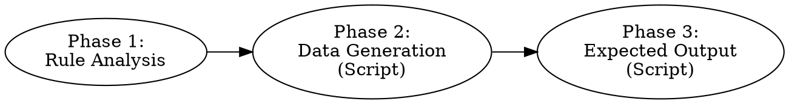
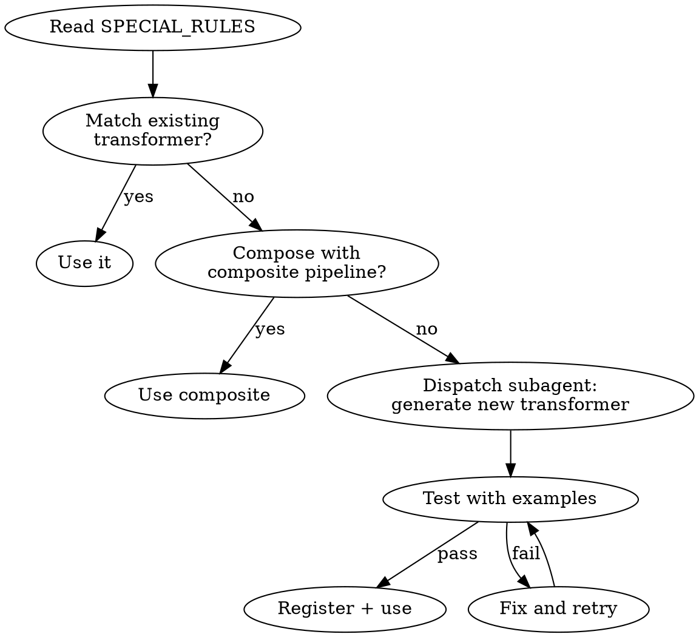

# ETL Test Data Generator

## Overview

Rule-driven test data generation for ETL pipelines. Scripts handle deterministic pre-parsing, data generation, and transformation; agent handles semantic analysis of complex transformation rules.

**Core principle**: Scripts do what's deterministic; agent does what requires understanding.

## When to Use

- Need test data for an ETL / data integration pipeline
- Have a rules file (CSV) defining source → target field mappings
- Need both **source test data** and **expected output** for validation

## Three-Phase Workflow



### Phase 1: Rule Analysis

**Step 1 — Run rule_parser.py (Script, deterministic)**

```bash
python scripts/rule_parser.py \
  --rules case/xxx/rules.csv \
  --case my_case \
  --case-dir case/xxx \
  --output output/my_case/rule_config_draft.json
```

This auto-resolves ~80-90% of rules:
- Type A (has CARRIER_COLUMN_NAME, no SPECIAL_RULES) → `direct` mapping
- Type B (has DEFAULT only) → `fixed_values`
- Empty → no rule needed

Remaining rules go into `unresolved_rules` list.

**Step 2 — Resolve unresolved_rules (Agent)**

For each entry in `unresolved_rules`, apply the four-layer fallback:



Move resolved rules from `unresolved_rules` into `transformation_rules`. Delete `unresolved_rules` field. Add `field_metadata` and `conditional_coverage` as needed. Save as `rule_config.json`.

**Step 3 — Validate**

```bash
python scripts/transform_engine.py validate --config output/my_case/rule_config.json
```

### Phase 2: Source Data Generation (Script)

```bash
python scripts/data_generator.py \
  --config output/my_case/rule_config.json \
  --count 10 \
  --output output/my_case/generated_source.txt
```

### Phase 3: Expected Output Generation (Script)

```bash
python scripts/expected_generator.py \
  --config output/my_case/rule_config.json \
  --source output/my_case/generated_source.txt \
  --output output/my_case/generated_expected.txt
```

Custom transformers in `scripts/custom_transformers/` are loaded automatically at engine startup. Use `--custom-transformers <dir>` only to load transformers from an additional directory.

## Transformation Types Quick Reference

| Type | Use when SPECIAL_RULES says... | Config |
|------|-------------------------------|--------|
| `direct` | (empty) or "copy from" | `{"source_field": "X"}` |
| `fixed` | — (for DEFAULT values) | `{"value": "X"}` |
| `empty` | "blank" / "always empty" | `{}` |
| `name_parser` | "first name" / "LAST,FIRST" | `{"source_field": "X", "part": "first\|last"}` |
| `conditional_map` | "if X then Y" / "map A to B" | `{"source_field": "X", "mappings": {...}, "default": "C"}` |
| `split_extract` | "split by" / "before/after delimiter" | `{"source_field": "X", "delimiter": "-", "index": 0}` |
| `substring` | "left N" / "right N" / "first N chars" | `{"source_field": "X", "method": "left", "length": N}` |
| `phone_parser` | "area code" / "phone number" | `{"source_field": "X", "part": "area_code\|phone_number"}` |
| `composite` | Multiple steps combined | `{"source_field": "X", "pipeline": [{type, config}, ...]}` |

Run `python scripts/transform_engine.py schemas` for full details.

## Composite Transformer

Chain multiple transformers in a pipeline. Output of each step feeds into the next.

```json
{
  "transformation_type": "composite",
  "config": {
    "source_field": "Phone",
    "pipeline": [
      {"type": "substring", "config": {"method": "left", "length": 10, "strip_chars": "()-. "}},
      {"type": "substring", "config": {"method": "left", "length": 3}}
    ]
  }
}
```

## Generating New Transformers (Subagent Workflow)

When no existing transformer or composite can handle a SPECIAL_RULES, dispatch a subagent to generate a new one.

### Subagent Prompt Template

```
Task: Create a new generic transformer for the ETL transform engine.

SPECIAL_RULES text: "{special_rules_text}"
NOTE: "{note_text}"
Source field: "{source_field}"
Example input → output (from NOTE): {examples}

Requirements:
1. Follow the 5-step generalization process below
2. Write a *_transformer.py file in scripts/custom_transformers/
3. Test it with the transform_engine.py CLI
4. The transformer must be GENERIC — parameterized for reuse across different scenarios

Existing transformer schemas (for reference / composite attempts):
{output of: python scripts/transform_engine.py schemas}
```

### 5-Step Generalization Process

The subagent MUST follow these steps:

**Step 1: Identify the essential operation**

Ask: what TYPE of operation is this?
- String manipulation (clean, trim, replace, extract, concatenate)
- Format conversion (date, number, case)
- Conditional logic (if-then-else, threshold comparison)
- Mathematical (comparison, arithmetic)
- Combination (multiple of the above → try composite first)

**Step 2: Try existing transformers + composite first**

Before writing new code, verify that no combination of existing transformers can solve it. Only proceed to Step 3 if truly impossible.

**Step 3: Extract parameters (critical step)**

Method: replace every concrete value in the rule with a variable name. What remains is the logic skeleton.

```
Example: "Remove prefix 'US-' then take the value"
  concrete values: "US-" → variable: pattern
  operation: replace/remove → this is a regex_replace operation
  config: {source_field, pattern, replacement}

Example: "If value > 100 mark Y else N"
  concrete values: 100, "Y", "N" → variables: threshold, above_value, below_value
  operation: numeric comparison
  config: {source_field, threshold, operator, above_value, below_value}
```

Self-check: if the concrete values change (100→200, "Y"→"Pass"), does the function still work? If yes, parameterization is correct.

**Step 4: Design schema**

Every config parameter must have: type, required, description, enum (if applicable).
`examples` must include at least 2 DIFFERENT scenarios proving the transformer is generic.

**Step 5: Implement and verify**

- Handle None and empty string (return "")
- Strip whitespace from input
- Read all values from config, NEVER hardcode
- Test with: `python scripts/transform_engine.py transform --custom-transformers scripts/custom_transformers --config ... --record '...'`

### Pre-submission Checklist

```
□ Class name contains NO business/domain terms (no HumanaXxx, no MedicareXxx)
□ transform() contains NO hardcoded strings or numbers — all from config
□ schema() examples show 2+ different scenarios
□ Would this transformer work for a completely different business domain?
□ File is named {type_name}_transformer.py
□ File ends with TransformerRegistry.register_transformer() call
□ Tested with transform_engine.py CLI and output matches expected
```

## rule_config.json Structure

```json
{
  "case_name": "my_test_case",
  "source_format": "pipe",
  "source_fields": ["Employee_ID", "Full_Name", "DOB"],
  "target_fields": ["EMPLOYEE_ID", "FIRST_NAME", "LAST_NAME"],
  "fixed_values": {"COMPANY_NAME": "ACME Corp"},
  "transformation_rules": [
    {
      "target_field": "FIRST_NAME",
      "source_field": "Full_Name",
      "transformation_type": "name_parser",
      "config": {"source_field": "Full_Name", "part": "first"}
    }
  ],
  "field_metadata": [
    {"field_name": "Full_Name", "data_type": "string", "format_hint": "LAST,FIRST"}
  ],
  "conditional_coverage": {
    "Status_Code": ["A", "B", "T"]
  },
  "record_count": 10,
  "output_metadata": {"ACTION_ID": "my-test-case-etl"}
}
```

Note: `conditional_coverage` is for **data generation coverage** (ensure test data includes these values), NOT for defining transformation mappings. Use an array of values. Mappings are defined in `transformation_rules` via `conditional_map`.

See `reference/rule_config_schema.json` for the full JSON Schema.

## Scripts Reference

Install dependencies: `pip install -r scripts/requirements.txt`

| Script | Purpose | Key args |
|--------|---------|----------|
| `rule_parser.py` | Pre-parse rules.csv → draft config | `--rules`, `--case`, `--case-dir`, `--output` |
| `transform_engine.py` | Validate config / apply transforms / show schemas | `validate\|transform\|schemas`, `--custom-transformers` |
| `data_generator.py` | Generate fake source test data | `--config`, `--count`, `--output` |
| `expected_generator.py` | Generate expected transformation output | `--config`, `--source`, `--output`, `--custom-transformers` |

## Common Mistakes

| Mistake | Fix |
|---------|-----|
| `source_field` missing in config | Always include `source_field` in both the rule AND the config dict |
| Confusing `conditional_coverage` with mappings | `conditional_coverage` = data generation coverage (array). Mappings = `conditional_map` in transformation_rules |
| Custom transformer with hardcoded values | All concrete values must be config parameters |
| Custom transformer with domain-specific name | Name by the operation, not the business context |
| Forgetting `--custom-transformers` flag | Pass `--custom-transformers scripts/custom_transformers` to transform_engine.py and expected_generator.py |
